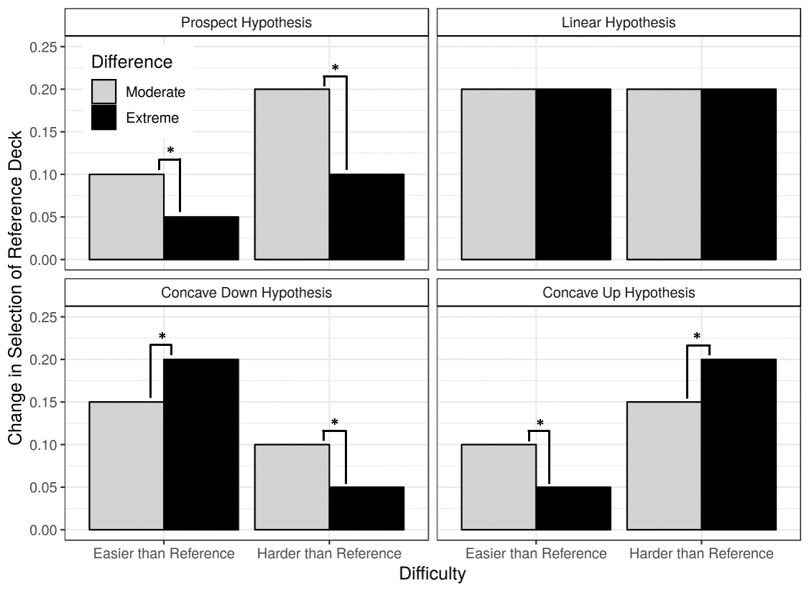

```{r include=FALSE}
library(tidyverse)
library(ez)
library(data.table)
```


This document is dedicated to conducting the confirmatory choice analyses that were proposed for Experiment 1. 

## Design
The design is 2 (difficulty: harder than reference vs. easier than reference) X 2 (difference: moderate vs. extreme). The analysis is a 2 X 2 within-subjects ANOVA on the change in selection of reference deck. The dependent variable is complicated (see document for explanation), but it can be thought of as a difference score---how does selection of the reference deck change as the critical deck changes in intensity?

## Predictions
The predictions are visualized below:



Where, on the prospect hypothesis, both moderate conditions are expected to have significantly larger changes in selection of reference than their respsective extreme conditions.

## Results
The cleaned data can be seen below:
```{r}
d <- read.csv('../../../data/dstClean.csv')
n <- d %>% 
  group_by(subject) %>% 
  summarize(n()) %>% 
  nrow(.)
d
```
**The sample size is `r n`.**


### Visualize the Results

Below is just the proportion selection of reference deck. Recall that all models predict increased selection of reference deck as critical deck increases in intensity.  


```{r}
d <- d %>% 
  mutate(selRefDeck = ifelse(chosenDeckId == 'reference', 1, 0)) %>% 
  mutate(difference = factor(difference, levels = levels(factor(difference))[c(2,1)])) 
d %>% 
  group_by(subject, difference, difficulty) %>% 
  summarize(selRefDeck = mean(selRefDeck)) %>% 
  group_by(difference, difficulty) %>% 
  summarize(mSelRefDeck = mean(selRefDeck), se = sd(selRefDeck) / sqrt(n())) %>% 
  ggplot(aes(x = difficulty, y = mSelRefDeck, group = difference)) + 
  geom_bar(stat = 'identity', aes(fill = difference), color = 'black', position = position_dodge(width = 0.9)) + 
  geom_errorbar(aes(ymin = mSelRefDeck - se, ymax = mSelRefDeck + se), position = position_dodge(width = 0.9), width = 0.5) +
  theme_bw() + 
  xlab('Difficulty') +
  ylab('Proportion Selection of Reference Deck') +
  ylim(0,1) +
  scale_fill_manual(name = 'Difference', values = c(Moderate = 'Light Grey', Extreme = 'Black')) + 
  theme(legend.position = 'top')
  
```
Visualize the underlying subject data


```{r}

condMeans <- d %>% 
  group_by(subject, condition) %>% 
  summarize(selRefDeck = mean(selRefDeck)) %>% 
  group_by(condition) %>% 
  summarize(selRefDeck = mean(selRefDeck)) 
  
## building in the option to break subjects down by hypothesis
## a little underwhelming
subjectCodes <- d %>% 
  group_by(subject, condition) %>% 
  summarize(selRefDeck = mean(selRefDeck)) %>% 
  spread(condition, selRefDeck) %>% 
  mutate(rational = ifelse(EE < EM & EM < HM & HM < HE, 'yes', 'no')) %>% 
  mutate(EEDev = EM - EE, EMDev = 0.5 - EM, HMDev = HM - 0.5, HEDev = HE - HM) %>% 
  mutate(model = ifelse(EMDev > EEDev & HMDev > HEDev, 'Prospect', ifelse(EEDev > EMDev & EMDev > HMDev & HMDev > HEDev, 'Concave Down',
                                                                          ifelse(EEDev < EMDev & EMDev < HMDev & HMDev < HEDev, 'Concave Up', 'Other')))) %>% 
  select(subject, rational, model)

d %>% 
  mutate(condition = factor(condition, levels = levels(condition)[c(2,1,4,3)])) %>% 
  group_by(subject, condition) %>% 
  summarize(selRefDeck = mean(selRefDeck)) %>% 
  inner_join(subjectCodes) %>% 
  ggplot(aes(x = condition, y = selRefDeck)) + 
  geom_violin(fill = NA) +
  geom_boxplot(fill = NA) + 
  geom_point(alpha = .3) +
  geom_line(aes(group = subject), alpha = .6, linetype = 'dashed') +
  geom_point(data = condMeans, aes(x = condition, y = selRefDeck), size = 4, fill = 'red', shape = 23) +
  geom_label(data = condMeans, aes(x = condition, y = selRefDeck, label = round(selRefDeck,2), hjust = 1.5, vjust = 1.5)) +
  scale_x_discrete(labels = c(`EM` = 'Easy Moderate', `EE` = 'Extreme Easy', `HM` = 'Hard Moderate', `HE` = 'Hard Extreme')) +
  labs(
    title = 'Selection of reference deck by condition and subject',
    caption = 'Red diamonds are condition means. Horizontal black lines are medians.',
    x = 'Critical Deck Intensity Level',
    y = 'Proportion Selection of Reference Deck'
  ) +
  theme_bw()
  
```


Below are the subject-wise cell means.  

```{r}
condTable <- data.frame(condition = c('EE','EM','HE','HM'), difficulty = c(rep('Easier than Reference', 2), rep('Harder than Reference', 2)), difference = rep(c('Extreme', 'Moderate'), 2))
subjectCellMeans <- d %>% 
  mutate(selRefDeck = ifelse(chosenDeckId == 'reference', 1, 0)) %>% 
  group_by(subject, condition) %>% 
  summarize(selRefDeck = mean(selRefDeck)) %>% 
  spread(condition, selRefDeck) %>% 
  mutate(EEDEV = EM - EE, EMDEV = 0.5 - EM, HMDEV = HM - 0.5, HEDEV = HE - HM) %>% 
  select(-(EE:HM)) %>% 
  gather(condition, selRefDeck, contains('DEV')) %>% 
  mutate(condition = str_replace(condition, 'DEV', '')) %>% 
  inner_join(condTable) %>% 
  select(-condition) 
subjectCellMeans

  
```
And finally the critical 2 X 2 plot:

```{r}
cellMeans <- subjectCellMeans %>% 
  mutate(difference = factor(difference, levels = levels(factor(difference))[c(2,1)])) %>% 
  group_by(difficulty, difference) %>% 
  summarize(mSelRefDeck = mean(selRefDeck), se = sd(selRefDeck) / sqrt(n())) 
cellMeans
cellMeans %>% 
  ggplot(aes(x = difficulty, y = mSelRefDeck, group = difference)) +
  geom_bar(stat = 'identity', aes(fill = difference), color = 'black', position = position_dodge(width = 0.9)) +
  geom_errorbar(aes(ymin = mSelRefDeck - se, ymax = mSelRefDeck + se), position = position_dodge(width = 0.9), width = 0.5) +
  theme_bw() +
  xlab('Difficulty') +
  ylab('Change in Selection of Reference Deck') +
  scale_fill_manual(name = 'Difference', values = c(Moderate = 'Light Grey', Extreme = 'Black')) + 
  theme(legend.position = 'top')
```


### Statistics

**Omnibus model:**

```{r}
m1 <- ezANOVA(wid = subject, within = .(difficulty, difference), dv = selRefDeck, data = subjectCellMeans, detailed = TRUE)
cs <- c(colnames(m1$ANOVA), 'n2p')
omni <- cbind(m1, data.frame(n2p = m1$ANOVA$SSn / (m1$ANOVA$SSn + m1$ANOVA$SSd)))
colnames(omni) <- cs
omni
SSd <- m1$ANOVA$SSd[4]
DFd <- m1$ANOVA$DFd[4]
MSe <- SSd / DFd

```


**Main effect of difficulty**
```{r}
subjectCellMeans %>% 
  group_by(difficulty) %>% 
  summarize(srd = mean(selRefDeck), se = sd(selRefDeck) / sqrt(n))
```


**Planned comparisons:**

```{r}

## For harder than reference
m2 <- ezANOVA(wid = subject, within = difference, dv = selRefDeck, data = subjectCellMeans[subjectCellMeans$difficulty == 'Harder than Reference',], detailed = TRUE)
SSn <- m2$ANOVA$SSn[2]
DFn <- m2$ANOVA$DFn[2]
MSn <- SSn / DFn
f_value <- MSn / MSe
p_value <- pf(f_value, DFn, DFd, lower.tail = FALSE)
n2p <- SSn / (SSn + SSd)
harder <- paste('F(',DFn, ', ', DFd, ') = ', round(f_value, 2), ', p = ', round(p_value, 2), ', n2p = ', round(n2p, 2), sep = '')

## For easier than reference
m3 <- ezANOVA(wid = subject, within = difference, dv = selRefDeck, data = subjectCellMeans[subjectCellMeans$difficulty == 'Easier than Reference',], detailed = TRUE)
SSn <- m3$ANOVA$SSn[2]
DFn <- m3$ANOVA$DFn[2]
MSn <- SSn / DFn
f_value <- MSn / MSe
p_value <- pf(f_value, DFn, DFd, lower.tail = FALSE)
n2p <- SSn / (SSn + SSd)
easier <- paste('F(',DFn, ', ', DFd, ') = ', round(f_value, 2), ', p = ', round(p_value, 2), ', n2p = ', round(n2p, 2), sep = '')

data.frame(Contrast = c('Simple effect of difference for Harder than Reference', 'Simple effect of difference for Easier than Reference'), Result = c(harder, easier))
```


**Post-hoc follow up**  
Comparing the moderate conditions

```{r}
source('../../../../exp2/scripts/formatSimpleEffects.r')
omnibusParams <- c(DFd = DFd, MSe = MSe, SSd = SSd)

m4 <- ezANOVA(wid = subject, within = .(difficulty), dv = selRefDeck, data = subjectCellMeans[subjectCellMeans$difference == 'Moderate',], detailed = TRUE)

s1 <- 'Simple effect of difficulty for moderate difference:'
      
r1 <- formatSimpleEffects(m4, omnibusParams)

m5 <- ezANOVA(wid = subject, within = .(difficulty), dv = selRefDeck, data = subjectCellMeans[subjectCellMeans$difference == 'Extreme',], detailed = TRUE)

s2 <- 'Simple effect of difficulty for extreme difference:'
      
r2 <- formatSimpleEffects(m5, omnibusParams)

data.frame(Contrast = c(s1, s2), Result = c(r1, r2))

```


## Testing against chance

We want to see whether participants were significantly above chance in selecting the easier of the two decks presented in any block.

```{r}
sub_means <- d %>% 
  group_by(subject, difficulty) %>% 
  summarize(srd = mean(selRefDeck)) %>% 
  data.table()

print(t.test(sub_means[difficulty == 'Easier than Reference',]$srd, mu = .5))
print(t.test(sub_means[difficulty == 'Harder than reference',]$srd, mu = .5))

sub_means %>% 
  group_by(difficulty) %>% 
  summarize(m = mean(srd), se = sd(srd) / sqrt(n))
```


