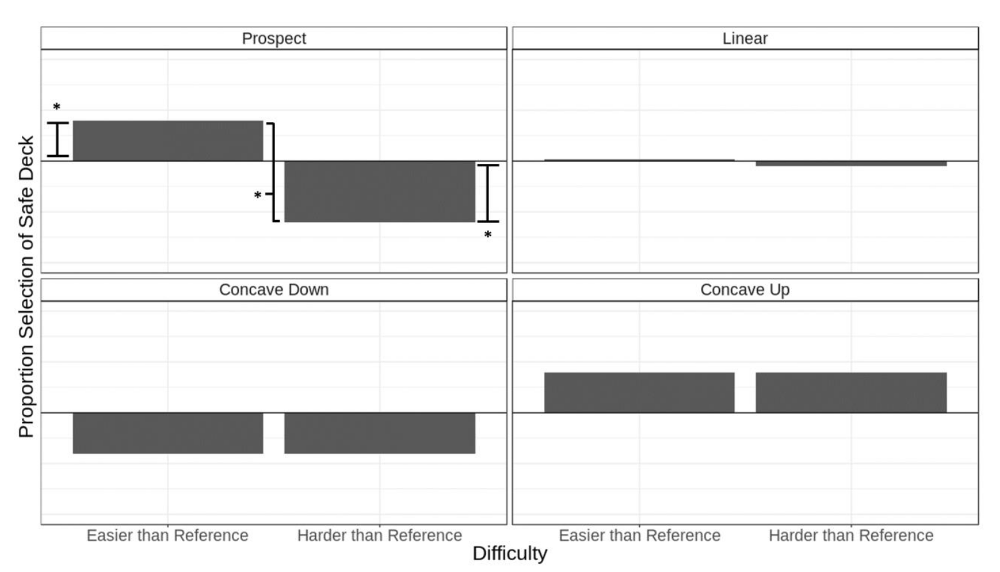

```{r include = FALSE}
library(tidyverse)
library(ggExtra)
library(ez)
source('../../formatSimpleEffects.r')
```


*This document was last updated at `r Sys.time()`.*

This document is dedicated to the confirmatory choice analyses that were proposed for Experiment 2.

## Design
The design is 2 (difficulty: easier than reference vs. harder than reference) X 2 (difference: moderate vs. extreme). The analysis is a 2 X 2 within-subjects ANOVA on the proportion selection of the safe deck.  

## Predictions
The critical prediction hinges on the main effect of difficulty. The prospect model predicts that choices will be risk averse when all outcomes are easier (or equal to) the reference deck, and that choices will be risk seeking when all outcomes are harder (or equal to) the reference deck. The predictions are visualized below:



All other hypotheses predict that choices won't depend on difficulty. Concave up and down predict that choices, overall, will either be risk averse or risk seeking, respectively.

# Results

The cleaned data can be seen below
```{r}
dst <- read.csv('../../../data/dstCleanChoice.csv')
n <- dst %>% 
  group_by(subject) %>% 
  summarize(n()) %>% 
  nrow()
dst
```

**The sample size is `r n`.**

# Choice Trimming Criteria {.tabset}

## No trimming

I'll first visualize the results broken down across the whole design, followed by a breakdown by only the critical difficulty variable.

```{r}
dst <- dst %>% 
  mutate(difference = factor(difference, levels = levels(difference)[c(2,1)]),
         selSafeDeck = ifelse(selectedRiskyDeck == 1, 0, 1))
```


```{r}
dst %>% 
  group_by(subject, difference, difficulty) %>% 
  summarize(selSafeDeck = mean(selSafeDeck)) %>% 
  group_by(difference, difficulty) %>% 
  summarize(ssd = mean(selSafeDeck), se = sd(selSafeDeck) / sqrt(n)) %>% 
  ggplot(aes(x = difficulty, y = ssd, group = difference)) +
  geom_bar(stat = 'identity', aes(fill = difference), color = 'black', position = position_dodge(width = 0.9)) + 
  geom_errorbar(aes(ymin = ssd - se, ymax = ssd + se), position = position_dodge(width = 0.9), width = 0.5) +
  labs(
    x = 'Difficulty',
    y = 'Proportion Selection of Safe Deck',
    caption = 'Dashed line represents selecting at chance'
  ) +
  ylim(0, 1) +
  geom_hline(yintercept = 0.5, linetype = 'dashed') +
  scale_fill_manual(name = 'Difference', values = c(Moderate = 'light grey', Extreme = 'black')) +
  theme_bw()
```

Main effect of difficulty:

```{r}
dst %>% 
  group_by(subject, difficulty) %>% 
  summarize(selSafeDeck = mean(selSafeDeck)) %>% 
  group_by(difficulty) %>% 
  summarize(ssd = mean(selSafeDeck), se = sd(selSafeDeck) / sqrt(n)) %>% 
  ggplot(aes(x = difficulty, y = ssd)) + 
  geom_bar(stat = 'identity') +
  geom_errorbar(aes(ymin = ssd - se, ymax = ssd + se), width = 0.5) +
  labs(
    x = 'Difficulty',
    y = 'Proportion Selection of Safe Deck',
    caption = 'Dashed line represents selecting at chance'
  ) + 
  ylim(0,1) +
  geom_hline(yintercept = 0.5, linetype = 'dashed') +
  theme_bw()
```

Visualize subject data underlying the difficulty variable:

```{r}
condMeans <- dst %>% 
  group_by(subject, difficulty) %>% 
  summarize(ssd = mean(selSafeDeck)) %>% 
  group_by(difficulty) %>% 
  summarize(ssd = mean(ssd))

uSubjects <- unique(dst$subject)

subjectCode <- data.frame(subject = uSubjects)
subjectCode$subjectLabel <- factor('', levels = c('Supports prospect theory', 'Opposite prospect theory', 'No difference'))

for (i in uSubjects) {
  t <- dst[dst$subject == i, c('difficulty', 'selSafeDeck')]
  mns <- c(e = mean(t[t$difficulty == 'Easier than Reference',]$selSafeDeck), h = mean(t[t$difficulty == 'Harder than Reference',]$selSafeDeck))
  
  
  if (mns[1] != mns[2]) {
    m1 <- t.test(t[t$difficulty == 'Easier than Reference',]$selSafeDeck, t[t$difficulty == 'Harder than Reference',]$selSafeDeck, within = TRUE)
  } else {
    subjectCode[subjectCode$subject == i,]$subjectLabel <- 'No difference'
    next
  }
  
  if (mns['e'] > mns['h'] & m1$p.value < .05) {
    subjectCode[subjectCode$subject == i,]$subjectLabel <- 'Supports prospect theory'
  } else if (mns['e'] < mns['h'] & m1$p.value < .05) {
    subjectCode[subjectCode$subject == i,]$subjectLabel <- 'Opposite prospect theory'
  } else {
    subjectCode[subjectCode$subject == i,]$subjectLabel <- 'No difference'
  }
} 

dst <- subjectCode %>% 
  inner_join(dst)


```

```{r}

dst %>% 
  group_by(subject, subjectLabel) %>% 
  summarize(count = n()) %>% 
  group_by(subjectLabel) %>% 
  summarize(count = n())

dst %>% 
  group_by(subject, difficulty) %>% 
  summarize(ssd = mean(selSafeDeck), subjectLabel = unique(subjectLabel)) %>% 
  ggplot(aes(x = difficulty, y = ssd)) +
  geom_violin(fill = NA, alpha = 0.2) + 
  geom_boxplot(fill = NA, alpha = 0.3) +
  geom_jitter(alpha = 0.4, width = .05, height = 0) +
  geom_line(aes(group = subject, color = subjectLabel), linetype = 'dashed', alpha = .3) +
  geom_point(data = condMeans, aes(x = difficulty, y = ssd), size = 4, shape = 23, color = 'black', fill = 'red') +
  geom_hline(yintercept = 0.5, linetype = 'dotted') +
  geom_label(data = condMeans, aes(x = difficulty, y = ssd, label = round(ssd, 2)), hjust = 1.5, vjust = 1.5) +
  scale_color_manual(name = 'Subject Label', values = c(`Supports prospect theory` = 'dark green', `Opposite prospect theory` = 'red', `No difference` = 'black')) +
  ylim(0,1) + 
  theme_bw() +
  labs(
    title = 'Selection of safe deck by difficulty and subject',
    x = 'Difficulty',
    y = 'Proportion Selection of Safe Deck',
    caption = 'Red diamond reflects condition means. Horizontal, black, solid lines reflect medians.'
  ) +
  theme(legend.position = 'bottom')
```


### Statistics

```{r}
m1 <- ezANOVA(wid = subject, within = .(difference, difficulty), dv = selSafeDeck, data = dst, detailed = TRUE)
m1a <- data.frame(m1$ANOVA)
m1a$p <- round(m1a$p, 3)
m1a$n2p <- round(m1a$SSn / (m1a$SSn + m1a$SSd),3)
m1a
```

**Means for difference effect**
```{r}
dst %>% 
  group_by(difference, subject) %>% 
  summarize(selSafeDeck = mean(selSafeDeck)) %>% 
  group_by(difference) %>% 
  summarize(ssd = mean(selSafeDeck), se = sd(selSafeDeck)/ sqrt(n))
```


Following up on the marginal interaction by comparing the two extreme conditions:

```{r}
DFd <- m1$ANOVA$DFd[4]
SSd <- m1$ANOVA$SSd[4]
MSe <- SSd / DFd
omnibusParams <- c(DFd = DFd, SSd = SSd, MSe = MSe)

m2 <- ezANOVA(wid = subject, within = .(difficulty), dv = selSafeDeck, data = dst[dst$difference == 'Extreme',], detailed = TRUE)

s <- 'Simple effect of difficulty for Extreme difference'
r <- formatSimpleEffects(omnibusParams = omnibusParams, model = m2)
data.frame(Contrast = s, Result = r)
```

## Trial trimming


I'll first visualize the results broken down across the whole design, followed by a breakdown by only the critical difficulty variable.

```{r}
dst <- read.csv('../../../data/dstCleanChoice1.csv')
dst <- dst %>% 
  mutate(difference = factor(difference, levels = levels(difference)[c(2,1)]),
         selSafeDeck = ifelse(selectedRiskyDeck == 1, 0, 1))
```


```{r}
dst %>% 
  group_by(subject, difference, difficulty) %>% 
  summarize(selSafeDeck = mean(selSafeDeck)) %>% 
  group_by(difference, difficulty) %>% 
  summarize(ssd = mean(selSafeDeck), se = sd(selSafeDeck) / sqrt(n)) %>% 
  ggplot(aes(x = difficulty, y = ssd, group = difference)) +
  geom_bar(stat = 'identity', aes(fill = difference), color = 'black', position = position_dodge(width = 0.9)) + 
  geom_errorbar(aes(ymin = ssd - se, ymax = ssd + se), position = position_dodge(width = 0.9), width = 0.5) +
  labs(
    x = 'Difficulty',
    y = 'Proportion Selection of Safe Deck',
    caption = 'Dashed line represents selecting at chance'
  ) +
  ylim(0, 1) +
  geom_hline(yintercept = 0.5, linetype = 'dashed') +
  scale_fill_manual(name = 'Difference', values = c(Moderate = 'light grey', Extreme = 'black')) +
  theme_bw()
```

Main effect of difficulty:

```{r}
dst %>% 
  group_by(subject, difficulty) %>% 
  summarize(selSafeDeck = mean(selSafeDeck)) %>% 
  group_by(difficulty) %>% 
  summarize(ssd = mean(selSafeDeck), se = sd(selSafeDeck) / sqrt(n)) %>% 
  ggplot(aes(x = difficulty, y = ssd)) + 
  geom_bar(stat = 'identity') +
  geom_errorbar(aes(ymin = ssd - se, ymax = ssd + se), width = 0.5) +
  labs(
    x = 'Difficulty',
    y = 'Proportion Selection of Safe Deck',
    caption = 'Dashed line represents selecting at chance'
  ) + 
  ylim(0,1) +
  geom_hline(yintercept = 0.5, linetype = 'dashed') +
  theme_bw()
```

Visualize subject data underlying the difficulty variable:

```{r}
condMeans <- dst %>% 
  group_by(subject, difficulty) %>% 
  summarize(ssd = mean(selSafeDeck)) %>% 
  group_by(difficulty) %>% 
  summarize(ssd = mean(ssd))

uSubjects <- unique(dst$subject)

subjectCode <- data.frame(subject = uSubjects)
subjectCode$subjectLabel <- factor('', levels = c('Supports prospect theory', 'Opposite prospect theory', 'No difference'))

for (i in uSubjects) {
  t <- dst[dst$subject == i, c('difficulty', 'selSafeDeck')]
  mns <- c(e = mean(t[t$difficulty == 'Easier than Reference',]$selSafeDeck), h = mean(t[t$difficulty == 'Harder than Reference',]$selSafeDeck))
  
  
  if (mns[1] != mns[2]) {
    m1 <- t.test(t[t$difficulty == 'Easier than Reference',]$selSafeDeck, t[t$difficulty == 'Harder than Reference',]$selSafeDeck, within = TRUE)
  } else {
    subjectCode[subjectCode$subject == i,]$subjectLabel <- 'No difference'
    next
  }
  
  if (mns['e'] > mns['h'] & m1$p.value < .05) {
    subjectCode[subjectCode$subject == i,]$subjectLabel <- 'Supports prospect theory'
  } else if (mns['e'] < mns['h'] & m1$p.value < .05) {
    subjectCode[subjectCode$subject == i,]$subjectLabel <- 'Opposite prospect theory'
  } else {
    subjectCode[subjectCode$subject == i,]$subjectLabel <- 'No difference'
  }
} 

dst <- subjectCode %>% 
  inner_join(dst)


```

```{r}

dst %>% 
  group_by(subject, subjectLabel) %>% 
  summarize(count = n()) %>% 
  group_by(subjectLabel) %>% 
  summarize(count = n())

dst %>% 
  group_by(subject, difficulty) %>% 
  summarize(ssd = mean(selSafeDeck), subjectLabel = unique(subjectLabel)) %>% 
  ggplot(aes(x = difficulty, y = ssd)) +
  geom_violin(fill = NA, alpha = 0.2) + 
  geom_boxplot(fill = NA, alpha = 0.3) +
  geom_jitter(alpha = 0.4, width = .05, height = 0) +
  geom_line(aes(group = subject, color = subjectLabel), linetype = 'dashed', alpha = .3) +
  geom_point(data = condMeans, aes(x = difficulty, y = ssd), size = 4, shape = 23, color = 'black', fill = 'red') +
  geom_hline(yintercept = 0.5, linetype = 'dotted') +
  geom_label(data = condMeans, aes(x = difficulty, y = ssd, label = round(ssd, 2)), hjust = 1.5, vjust = 1.5) +
  scale_color_manual(name = 'Subject Label', values = c(`Supports prospect theory` = 'dark green', `Opposite prospect theory` = 'red', `No difference` = 'black')) +
  ylim(0,1) + 
  theme_bw() +
  labs(
    title = 'Selection of safe deck by difficulty and subject',
    x = 'Difficulty',
    y = 'Proportion Selection of Safe Deck',
    caption = 'Red diamond reflects condition means. Horizontal, black, solid lines reflect medians.'
  ) +
  theme(legend.position = 'bottom')
```


### Statistics

```{r}
m1 <- ezANOVA(wid = subject, within = .(difference, difficulty), dv = selSafeDeck, data = dst, detailed = TRUE)
m1a <- data.frame(m1$ANOVA)
m1a$p <- round(m1a$p, 3)
m1a$n2p <- round(m1a$SSn / (m1a$SSn + m1a$SSd),3)
m1a
```

**Means for difference effect**
```{r}
dst %>% 
  group_by(difference, subject) %>% 
  summarize(selSafeDeck = mean(selSafeDeck)) %>% 
  group_by(difference) %>% 
  summarize(ssd = mean(selSafeDeck), se = sd(selSafeDeck)/ sqrt(n))
```


Following up on the marginal interaction by comparing the two extreme conditions:

```{r}
DFd <- m1$ANOVA$DFd[4]
SSd <- m1$ANOVA$SSd[4]
MSe <- SSd / DFd
omnibusParams <- c(DFd = DFd, SSd = SSd, MSe = MSe)

m2 <- ezANOVA(wid = subject, within = .(difficulty), dv = selSafeDeck, data = dst[dst$difference == 'Extreme',], detailed = TRUE)

s <- 'Simple effect of difficulty for Extreme difference'
r <- formatSimpleEffects(omnibusParams = omnibusParams, model = m2)
data.frame(Contrast = s, Result = r)
```

## Choice-based subject trimming

I'll first visualize the results broken down across the whole design, followed by a breakdown by only the critical difficulty variable.

```{r}
dst <- read.csv('../../../data/dstCleanChoice2.csv')
dst <- dst %>% 
  mutate(difference = factor(difference, levels = levels(difference)[c(2,1)]),
         selSafeDeck = ifelse(selectedRiskyDeck == 1, 0, 1))
```


```{r}
dst %>% 
  group_by(subject, difference, difficulty) %>% 
  summarize(selSafeDeck = mean(selSafeDeck)) %>% 
  group_by(difference, difficulty) %>% 
  summarize(ssd = mean(selSafeDeck), se = sd(selSafeDeck) / sqrt(n)) %>% 
  ggplot(aes(x = difficulty, y = ssd, group = difference)) +
  geom_bar(stat = 'identity', aes(fill = difference), color = 'black', position = position_dodge(width = 0.9)) + 
  geom_errorbar(aes(ymin = ssd - se, ymax = ssd + se), position = position_dodge(width = 0.9), width = 0.5) +
  labs(
    x = 'Difficulty',
    y = 'Proportion Selection of Safe Deck',
    caption = 'Dashed line represents selecting at chance'
  ) +
  ylim(0, 1) +
  geom_hline(yintercept = 0.5, linetype = 'dashed') +
  scale_fill_manual(name = 'Difference', values = c(Moderate = 'light grey', Extreme = 'black')) +
  theme_bw()
```

Main effect of difficulty:

```{r}
dst %>% 
  group_by(subject, difficulty) %>% 
  summarize(selSafeDeck = mean(selSafeDeck)) %>% 
  group_by(difficulty) %>% 
  summarize(ssd = mean(selSafeDeck), se = sd(selSafeDeck) / sqrt(n)) %>% 
  ggplot(aes(x = difficulty, y = ssd)) + 
  geom_bar(stat = 'identity') +
  geom_errorbar(aes(ymin = ssd - se, ymax = ssd + se), width = 0.5) +
  labs(
    x = 'Difficulty',
    y = 'Proportion Selection of Safe Deck',
    caption = 'Dashed line represents selecting at chance'
  ) + 
  ylim(0,1) +
  geom_hline(yintercept = 0.5, linetype = 'dashed') +
  theme_bw()
```

Visualize subject data underlying the difficulty variable:

```{r}
condMeans <- dst %>% 
  group_by(subject, difficulty) %>% 
  summarize(ssd = mean(selSafeDeck)) %>% 
  group_by(difficulty) %>% 
  summarize(ssd = mean(ssd))

uSubjects <- unique(dst$subject)

subjectCode <- data.frame(subject = uSubjects)
subjectCode$subjectLabel <- factor('', levels = c('Supports prospect theory', 'Opposite prospect theory', 'No difference'))

for (i in uSubjects) {
  t <- dst[dst$subject == i, c('difficulty', 'selSafeDeck')]
  mns <- c(e = mean(t[t$difficulty == 'Easier than Reference',]$selSafeDeck), h = mean(t[t$difficulty == 'Harder than Reference',]$selSafeDeck))
  
  
  if (mns[1] != mns[2]) {
    m1 <- t.test(t[t$difficulty == 'Easier than Reference',]$selSafeDeck, t[t$difficulty == 'Harder than Reference',]$selSafeDeck, within = TRUE)
  } else {
    subjectCode[subjectCode$subject == i,]$subjectLabel <- 'No difference'
    next
  }
  
  if (mns['e'] > mns['h'] & m1$p.value < .05) {
    subjectCode[subjectCode$subject == i,]$subjectLabel <- 'Supports prospect theory'
  } else if (mns['e'] < mns['h'] & m1$p.value < .05) {
    subjectCode[subjectCode$subject == i,]$subjectLabel <- 'Opposite prospect theory'
  } else {
    subjectCode[subjectCode$subject == i,]$subjectLabel <- 'No difference'
  }
} 

dst <- subjectCode %>% 
  inner_join(dst)


```

```{r}

dst %>% 
  group_by(subject, subjectLabel) %>% 
  summarize(count = n()) %>% 
  group_by(subjectLabel) %>% 
  summarize(count = n())

dst %>% 
  group_by(subject, difficulty) %>% 
  summarize(ssd = mean(selSafeDeck), subjectLabel = unique(subjectLabel)) %>% 
  ggplot(aes(x = difficulty, y = ssd)) +
  geom_violin(fill = NA, alpha = 0.2) + 
  geom_boxplot(fill = NA, alpha = 0.3) +
  geom_jitter(alpha = 0.4, width = .05, height = 0) +
  geom_line(aes(group = subject, color = subjectLabel), linetype = 'dashed', alpha = .3) +
  geom_point(data = condMeans, aes(x = difficulty, y = ssd), size = 4, shape = 23, color = 'black', fill = 'red') +
  geom_hline(yintercept = 0.5, linetype = 'dotted') +
  geom_label(data = condMeans, aes(x = difficulty, y = ssd, label = round(ssd, 2)), hjust = 1.5, vjust = 1.5) +
  scale_color_manual(name = 'Subject Label', values = c(`Supports prospect theory` = 'dark green', `Opposite prospect theory` = 'red', `No difference` = 'black')) +
  ylim(0,1) + 
  theme_bw() +
  labs(
    title = 'Selection of safe deck by difficulty and subject',
    x = 'Difficulty',
    y = 'Proportion Selection of Safe Deck',
    caption = 'Red diamond reflects condition means. Horizontal, black, solid lines reflect medians.'
  ) +
  theme(legend.position = 'bottom')
```


### Statistics

```{r}
m1 <- ezANOVA(wid = subject, within = .(difference, difficulty), dv = selSafeDeck, data = dst, detailed = TRUE)
m1a <- data.frame(m1$ANOVA)
m1a$p <- round(m1a$p, 3)
m1a$n2p <- round(m1a$SSn / (m1a$SSn + m1a$SSd),3)
m1a
```

**Means for difference effect**
```{r}
dst %>% 
  group_by(difference, subject) %>% 
  summarize(selSafeDeck = mean(selSafeDeck)) %>% 
  group_by(difference) %>% 
  summarize(ssd = mean(selSafeDeck), se = sd(selSafeDeck)/ sqrt(n))
```


Following up on the marginal interaction by comparing the two extreme conditions:

```{r}
DFd <- m1$ANOVA$DFd[4]
SSd <- m1$ANOVA$SSd[4]
MSe <- SSd / DFd
omnibusParams <- c(DFd = DFd, SSd = SSd, MSe = MSe)

m2 <- ezANOVA(wid = subject, within = .(difficulty), dv = selSafeDeck, data = dst[dst$difference == 'Extreme',], detailed = TRUE)

s <- 'Simple effect of difficulty for Extreme difference'
r <- formatSimpleEffects(omnibusParams = omnibusParams, model = m2)
data.frame(Contrast = s, Result = r)
```


